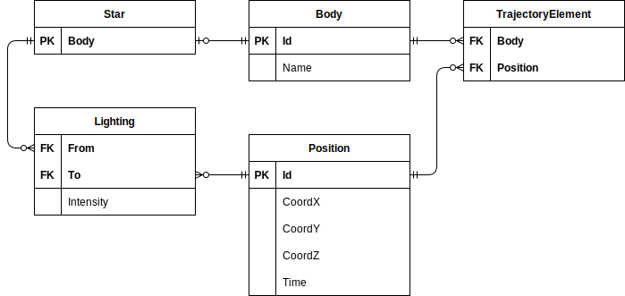

# Лабораторная работа № 4 по предмету &laquo;Информационные системы и базы данных&raquo;

Выполнил студент Суркис Антон Игоревич 
Группа P33113 
Преподаватель: Николаев Владимир Вячеславович

## Цель работы
Для отношений, полученных при построении предметной области из
лабораторной работы №1, выполните следующие действия:
- опишите функциональные зависимости для отношений полученной схемы (минимальное множество);
- приведите отношения в 3NF (как минимум). Постройте схему на основе полученных отношений;
- опишите изменения в функциональных зависимостях, произошедшие после преобразования в 3NF;
- преобразуйте отношения в BCNF. Докажите, что полученные отношения представлены в BCNF;
- какие денормализации будут полезны для вашей схемы? Приведите подробное описание;

## Выполнение

### Описание предметной области, по которой должна быть построена доменная модель:
Приближался миг, когда им впервые за все время полета предстояло распрощаться с Солнцем. Пусть побледневшее и маленькое, оно неизменно светило кораблю все пять месяцев с тех пор, как он покинул Землю. Но теперь траектория корабля уходила в тень Юпитера, и скоро перед ним должна была открыться ночная сторона планеты.

### Оригинальные связи из первой лабораторной:

### Функциональные зависимости оригинальной схемы:
- `Body.Id` => `Body.Name`
- `Position.Id` => `Position.CoordX`
- `Position.Id` => `Position.CoordY`
- `Position.Id` => `Position.CoordZ`
- `Position.Id` => `Position.Time`
- `Lighting.From`, `Lighting.To` => `Lighting.Intensity`

Эта схема уже приведена к BCNF:
- 1NF:
    - На пересечении строки и столбца таблицы только одно значение.
- 2NF:
    - Все атрибуты отношений `Star` (нет атрибутов), `Body`, `TrajectoryElement`, `Position` в полной функциональной зависимости от первичных ключей, состоящих из одного элемента каждый.
    - Атрибуты отношения `Lighting` в зависимости от первичного ключа (`Lighting.From`, `Lighting.To`),
        но не от каждого из элементов по отдельности: свет одной звезды имеет разную интенсивность
        в разное время и в разных точках, точно также как свет в одной точке от разных звезд.
- 3NF и BCNF:
    - Нет зависимостей атрибутов от атрибутов, не являющихся первичными ключами.

## Вывод
